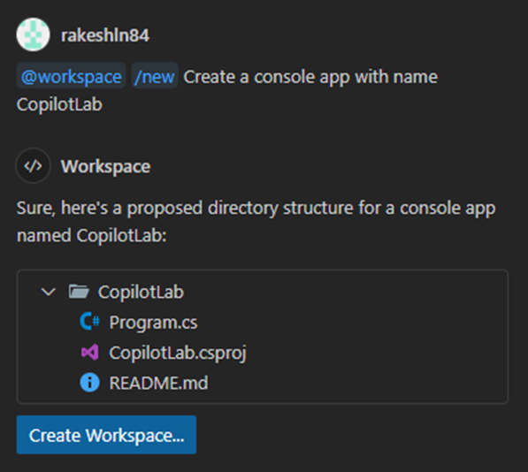

# Step 1: Getting Started with GitHub Copilot: Setting Up C# Console App

In this lab exercise, you will set up a new C# Console App using GitHub Copilot. This Console App will be enhanced in subsequent steps to build a Music Store application.

1. **Set Up Your Project Folder:**

   - Create a new folder named "CopilotLab" on your machine.
   - Open Visual Studio Code and load the "CopilotLab" folder.

2. **Access GitHub Copilot:**

   - Click on the Copilot icon in the activity bar.
   - Click on the "Chat in new tab" button to start a new chat session. You can now ask questions.

3. **Use Inline Suggestions:**

   - While coding, use the `CTRL + I` command to get inline suggestions from GitHub Copilot. This is useful when you're unsure how to write a specific piece of code. Start typing and press `CTRL + I` to see suggestions.

4. **Create a New C# Console App:**

   - Use Copilot chat to create a new C# Console App.
   - Type `/new Create a console app named CopilotLab` to generate a new C# console application.
   - Click on the `Create Workspace` button to set up the project.

   

5. **Run Your Application:**

   - After creating the project, ask Copilot for instructions on how to run the application.
   - Execute the following command in the terminal to run the Console App:

   ```bash
   dotnet run
   ```

[Previous - Home](./README.md) | [Next - Step 2: Building the Music Store Application](./02-Step02.md)
